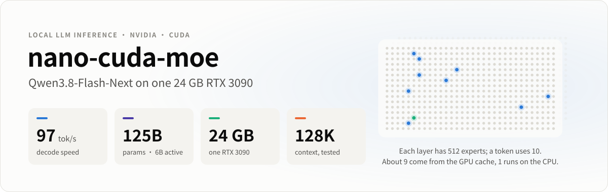
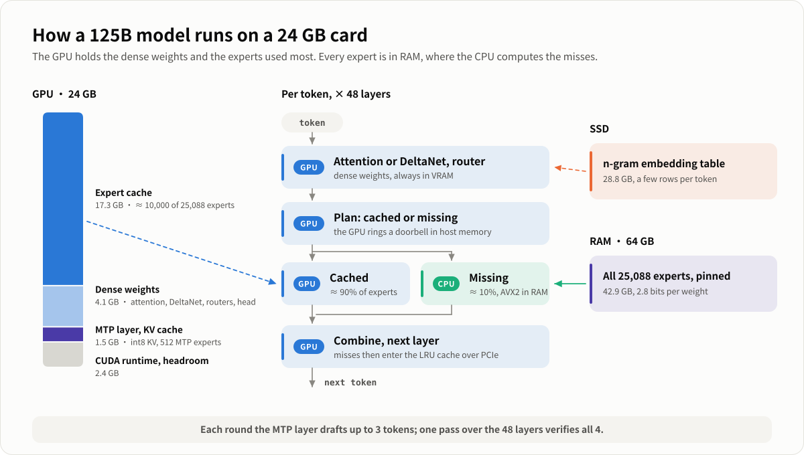
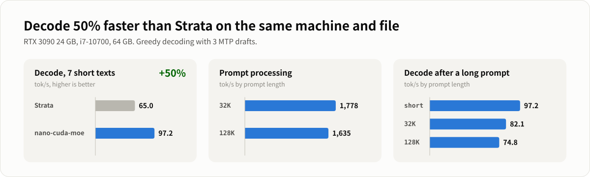

<picture>
  <source media="(prefers-color-scheme: dark)" srcset="docs/assets/hero-en-dark.svg">
  
</picture>

<p align="center">
  <a href="#quick-start">Quick start</a> ·
  <a href="#how-it-works">How it works</a> ·
  <a href="#performance">Performance</a> ·
  <a href="README.zh-CN.md">简体中文</a>
</p>

Run **Qwen3.8-Flash-Next**, a 125-billion-parameter Mixture-of-Experts model, on **one 24 GB RTX 3090 and 64 GB of
RAM** at about **97 tokens per second**. The engine is C++ and CUDA written for this model: one process, no Python or
ML framework at inference time, an OpenAI-compatible server and a chat page included.

This is the CUDA counterpart of [**nano-metal-moe-qwen36**](https://github.com/DaveByteAI/nano-metal-moe-qwen36),
which runs Qwen3.6-35B-A3B on a 16 GB Mac mini with Metal. Both start from the same observation: a MoE model needs
all of its experts somewhere, but each token touches only a few, so the expensive memory only has to hold the
experts that are used most.

<picture>
  <source media="(prefers-color-scheme: dark)" srcset="docs/assets/architecture-en-dark.svg">
  
</picture>

## Highlights

- **125B model, 24 GB card.** The 42.9 GB of experts live in pinned RAM. The GPU keeps the dense weights (4.1 GB) and
  a per-layer LRU cache of about 10,000 of the 25,088 experts (~17.5 GB), which serves ~90% of the experts a token
  needs.
- **The CPU computes the misses where they are.** No PCIe round trip: while the GPU runs the cached experts of a
  layer, the CPU runs the missing ones from RAM (AVX2), and the GPU waits on a flag in mapped memory. A whole
  decode step is one CUDA graph.
- **Speculative decoding with the model's own MTP layer.** It drafts up to 3 tokens; one pass over the 48 layers
  checks them, about 2.5-3 tokens per pass. With sampling, the drafts go through rejection sampling on the GPU, so the
  output distribution is unchanged.
- **Long context, up to the model's full 256K.** The model's sparse attention (an indexer picks 2048 positions per
  query) with an int8 KV cache: a 128K-token prompt is read in 78 s, a 256K one in 165 s (~1,550 tokens/s).
- **Usable.** `bl-server` speaks the OpenAI chat API (streaming, reasoning content, multi-turn prefix reuse) and serves
  a chat page; `bl-chat` is the terminal version.

## Performance

<picture>
  <source media="(prefers-color-scheme: dark)" srcset="docs/assets/performance-en-dark.svg">
  
</picture>

RTX 3090 24 GB (PCIe Gen3), Core i7-10700 (8 cores, AVX2), 64 GB DDR4, Linux. Model: ISTA-DASLab's GSQ-RCO IQ3_XXS
GGUF. Greedy decoding, 3 MTP drafts per round.

| | |
|---|---|
| Decode, 7 short texts (chat, code, docs; 200 tokens each) | **97 tok/s** |
| Decode, chat in the web page (temperature 0.7) | 92-104 tok/s |
| Decode after a 32K / 128K-token prompt | 82 / 75 tok/s |
| Prompt processing, 32K / 128K tokens | 18.0 s / 78 s |
| A 256K-token prompt (`--ctx 262144`): read / decode after it | 165 s / 66 tok/s |
| (`--ctx 262144` keeps 3.9 GB for the KV cache: the expert cache drops from 17.5 to 14 GB, short chats decode 5-12% slower) | |
| First token for a short question | ~0.4 s |
| Startup (75.8 GB read from NVMe) | ~25 s |
| (The first long prompt after a start reads the n-gram table from the SSD: ~2 s slower at 32K) | |
| Accuracy against llama.cpp on the same GGUF (4K prompt) | median KL 0.003-0.005, top-1 90-93% |

Compared with [Strata](https://github.com/eddoursul/Strata), another engine for this model, on the same machine with
the same GGUF file and inputs: decode is **50% faster here (97 vs 65 tok/s)** on the corpus; Strata reads long prompts faster (the 32K prompt in 13.3 s against 18.0 s here), and decodes after it at about the same speed (85 vs 82 tok/s). The [optimization log](docs/LOG.md) (in Chinese) has every step and its measurement.

## Requirements

- An NVIDIA GPU with 24 GB, compute capability 8.0 or newer (developed and measured on an RTX 3090, sm_86)
- 64 GB of RAM (the experts are pinned: 43 GB), an x86-64 CPU with AVX2
- 80 GB of disk, ideally NVMe (the 28.8 GB n-gram table is read a few rows per token)
- Linux, CUDA 12 or 13, CMake 3.24+, GCC 11+ (C++20), Python 3 (standard library only, for the download scripts)

## Quick start

### 1. Build

```bash
git clone https://github.com/DaveByteAI/nano-cuda-moe-qwen38
cd nano-cuda-moe-qwen38
cmake -B build                      # downloads llama.cpp (pinned) for ggml-cpu and the tokenizer
cmake --build build -j
```

Not an RTX 30-series card? Add `-DCMAKE_CUDA_ARCHITECTURES=native`. A CUDA toolkit outside `PATH`:
`-DCMAKE_CUDA_COMPILER=/path/to/nvcc`.

### 2. Get the model

```bash
scripts/download_model.sh          # into models/: 75.8 GB of GGUF, then the MTP layer (~5.5 GB fetched, 0.9 GB packed)
```

The model files come from [ISTA-DASLab/Qwen3.8-Flash-Next-GSQ-RCO-GGUF](https://huggingface.co/ISTA-DASLab/Qwen3.8-Flash-Next-GSQ-RCO-GGUF)
(SHA-256 checked, resumable). The GGUF has no MTP layer, so `tools/fetch_mtp.py` reads just its 31 tensors from the
official [BF16 checkpoint](https://huggingface.co/Qwen/Qwen3.8-Flash-Next) with HTTP Range requests (not the 360 GB),
and `bl-mtp-pack` quantizes its experts to Q2_0. In mainland China: `HF_ENDPOINT=https://hf-mirror.com scripts/download_model.sh`.

The repository has four quantizations; `scripts/download_model.sh QUANT` picks one (IQ3_XXS by default). The second
file, the 28.8 GB n-gram table, is the same in all four, so the script links one already present instead of fetching it.

| Quantization | First file | Routed experts | RAM for the LRU cache (experts + 12 GB) | Status |
|---|---|---|---|---|
| **IQ3_XXS** | 47.0 GB | 43.0 GB | 55 GB | tested (all numbers here) |
| IQ2_XS | 39.2 GB | ≈ 35 GB | ≈ 47 GB | untested |
| Q2_0 | 37.6 GB | ≈ 33.5 GB | ≈ 46 GB | untested |
| IQ3_S | 54.8 GB | 50.3 GB | 62 GB | runs: ~82 tok/s (IQ3_XXS: ~100 on the same texts); accuracy against llama.cpp not measured |

A name is only a label: each file mixes formats per layer (the IQ3_XXS one has IQ2_XXS, IQ2_XS, IQ2_S, IQ3_XXS and
IQ3_S experts, with IQ4_NL or Q2_0 for `down`; the IQ3_S one also IQ4_XS, and IQ4_XS token embeddings). The engine checks every expert tensor at start and stops with the
tensor's name if a format is not handled. A bigger file leaves a smaller share of its experts in VRAM, so it decodes
slower; a smaller one decodes faster at some cost in accuracy.

### 3. Run

```bash
build/bl-server --model models/Qwen3.8-Flash-Next-GSQ-RCO-IQ3_XXS-00001-of-00002.gguf --host 0.0.0.0 --port 8080
```

Open `http://<this machine>:8080` for the chat page, or use any OpenAI client with `base_url=http://<host>:8080/v1`.
In the terminal: `build/bl-chat --model models/...-00001-of-00002.gguf`.

## Usage

`bl-server --model SHARD1 [--host 127.0.0.1] [--port 8080] [--ctx 32768] [--name NAME] [--web DIR|none] [--expert-cache FILE]`

| | |
|---|---|
| `--ctx N` | context length (default 32768; up to 262144, the model's maximum, tested). A longer context leaves less VRAM for the expert cache: 262144 takes 3.9 GB of it |
| `--expert-cache FILE` | save the VRAM expert cache after each reply and start from it next time |
| `POST /v1/chat/completions` | `messages`, `stream`, `temperature` (0.7), `top_p` (0.8), `top_k` (20), `max_tokens`, `seed`, `reasoning_effort` or `chat_template_kwargs.enable_thinking`; thinking comes back as `reasoning_content`; `spec` (MTP drafts, 0-3) |
| `GET /v1/models`, `GET /health` | |
| `GET /bl/models`, `POST /bl/models {"id": "IQ3_S"}` | list the quantizations next to `--model` and switch to one (also in the chat page's settings); the reload takes 30-60 s, chat requests meanwhile get 503, and a model that fails to load gives way to the previous one |

One request is served at a time; a request that continues the previous conversation only processes the new part
(`usage.prompt_tokens_details.cached_tokens`). The chat page draws SVG code blocks as pictures, so "draw a cat
fishing" works.

`bl-chat --model SHARD1 [--ctx N] [--temp 0.7] [--top-p 0.8] [--top-k 20] [--spec 3] [--think off|low|medium|xhigh] [--system TEXT]`;
in the chat: `/reset`, `/think low`, `/temp 0.3`, `/stats`, `/exit`.

**Several GPUs (experimental)**: on the [`multi-gpu`](https://github.com/DaveByteAI/nano-cuda-moe-qwen38/tree/multi-gpu)
branch, `--gpus 0,1` splits the layers between the cards. So far checked only as two stages on one GPU, not yet on two
real GPUs; reports are welcome.

## Checking accuracy and speed

```bash
build/bl-run --model models/...-00001-of-00002.gguf --tokens-file bench/corpus/chat_zh.tokens --gen 200 --spec 3
BL_STAGE_PROF=1 build/bl-run ...      # the decode step's GPU time per stage
build/bench_dense models/...gguf 4    # kernel microbenchmarks: bench_dense, bench_experts, bench_idx, bench_cpu
BL_CPU_SHARE=0 build/test_window models/...gguf bench/prompts/mixed128.tokens   # a verify window = token by token, bit for bit
```

`bench/` holds the fixed inputs behind every number here (see [bench/README.md](bench/README.md)). Accuracy is
measured against llama.cpp's own forward pass on the same GGUF: `bl-ref-dump` writes its logits and per-layer
activations, `bl-run --ref` and `tools/logits_compare.py` (needs numpy) compare.

## How it works

- **Three tiers.** GPU: attention, the DeltaNet layers, the hyper-connection weights, routers, shared experts, the
  output head, the MTP layer and its 512 experts, the KV cache, and the expert cache in the rest of VRAM. RAM: all
  experts, pinned in huge pages. SSD: the n-gram embedding table, a few rows per token through the page cache.
- **The GPU plans each layer itself.** A kernel reads the router's choice, sorts the experts into cached and missing,
  writes the missing ones to mapped host memory ("rings the doorbell") and runs the cached ones; a host thread
  computes the missing ones on the CPU and raises a flag the GPU spins on. Each miss is then copied into the layer's
  LRU cache over PCIe for next time.
- **Verify windows.** The last token and up to 3 MTP drafts run through the 48 layers at once; the GDN state is only
  committed for the accepted tokens. Multi-token kernels (dp4a on int8 activations, tensor-core prefill) make a window
  of 4 cost little more than 1.
- **Prompts** go layer by layer over 8K-token chunks: cuBLAS GEMMs, tensor-core MoE and attention kernels, and the
  next layer's experts copied over PCIe while the current layer's attention runs.
- **Sparse attention.** The model's QSA layers attend to the 512 blocks of 4 positions an indexer scores highest (plus
  the tail); the KV cache is int8 with a scale per 32 values.

The [optimization log](docs/LOG.md) (Chinese) records each change with its measurement, including the ones that did not
work; [docs/MODEL.md](docs/MODEL.md) describes the model.

## Repository layout

```
src/            the engine: engine.cpp (scheduling, caches, prefill, MTP), cuda/ (kernels), cpu_*.cpp (AVX2 experts)
include/bl/     its interfaces
tools/          bl-server, bl-chat, bl-run, bl-tok, bl-ref-dump, bl-mtp-pack; fetch_mtp.py, make_rank.py, make_draft_vocab.py
tests/          correctness tests and kernel benchmarks
web/            the chat page (served by bl-server)
data/           expert-rank.bin (the cache's starting order), draft-vocab.bin (the MTP head's vocabulary)
bench/          the benchmark inputs and their generators
scripts/        download_model.sh
docs/           LOG.md (optimization log), MODEL.md, assets/ (figures: make_figures.py)
```

## Credits

- **Model:** [Qwen3.8-Flash-Next](https://huggingface.co/Qwen/Qwen3.8-Flash-Next) by the Qwen team; the GSQ-RCO
  quantization by [ISTA-DASLab](https://huggingface.co/ISTA-DASLab/Qwen3.8-Flash-Next-GSQ-RCO-GGUF). Their licenses
  apply to the model files, which are not part of this repository.
- **[llama.cpp / ggml](https://github.com/ggml-org/llama.cpp)** (MIT): the quantization formats and codebooks, the CPU
  dot products, the tokenizer, and the reference implementation every result is checked against.

## License

[Apache License 2.0](LICENSE).
