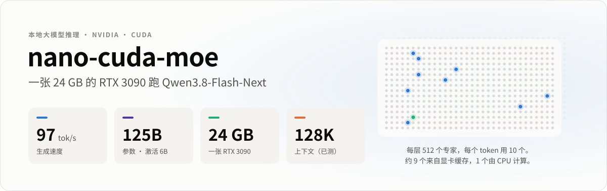
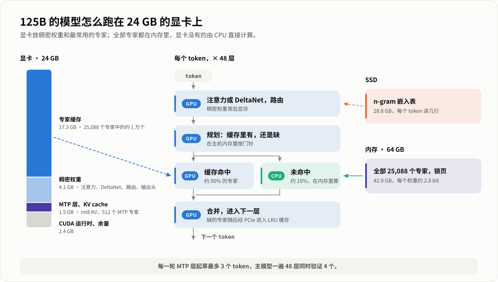
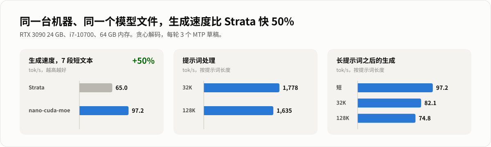

<picture>
  <source media="(prefers-color-scheme: dark)" srcset="docs/assets/hero-zh-dark.svg">
  
</picture>

<p align="center">
  <a href="#快速开始">快速开始</a> ·
  <a href="#原理">原理</a> ·
  <a href="#性能">性能</a> ·
  <a href="README.md">English</a>
</p>

在**一张 24 GB 的 RTX 3090、64 GB 内存**的普通电脑上，以**每秒约 97 个 token** 的速度运行 **Qwen3.8-Flash-Next**，
一个 1250 亿参数的混合专家（MoE）模型。引擎是为这个模型专门写的 C++ 和 CUDA：推理时只有一个进程，不需要 Python
或任何机器学习框架；自带 OpenAI 兼容的服务和聊天网页。

它是 [**nano-metal-moe-qwen36**](https://github.com/DaveByteAI/nano-metal-moe-qwen36) 的 CUDA 版本。那个项目用
Metal 在 16 GB 的 Mac mini 上运行 Qwen3.6-35B-A3B。两者出发点相同：MoE 模型的全部专家都得有地方放，但每个 token
只用到其中几个，所以昂贵的那层存储只需要装下最常用的专家。

<picture>
  <source media="(prefers-color-scheme: dark)" srcset="docs/assets/architecture-zh-dark.svg">
  
</picture>

## 亮点

- **125B 的模型，24 GB 的卡。** 42.9 GB 的专家放在锁页内存里。显卡上放稠密权重（4.1 GB），再加上每层一个 LRU
  专家缓存，装得下 25,088 个专家中的约 1 万个（约 17.5 GB），能满足一个 token 所需专家的约 90%。
- **未命中的专家由 CPU 就地计算。** 不走 PCIe 来回搬运：显卡算这一层缓存里的专家时，CPU 同时在内存里算缺的那些
  （AVX2），显卡等映射内存里的一个标志。整个 decode 步骤是一个 CUDA graph。
- **用模型自带的 MTP 层做投机解码。** 一次起草最多 3 个 token，主模型一遍 48 层把它们一起验证，平均每遍出 2.5–3 个
  token。采样时草稿在 GPU 上做拒绝采样，输出分布和不起草时完全相同。
- **长上下文。** 用模型自带的稀疏注意力（索引器为每个位置挑出 2048 个位置），KV cache 用 int8。128K token 的提示词
  每秒读约 1,600 个 token。
- **拿来就能用。** `bl-server` 兼容 OpenAI 的对话接口（流式输出、思考内容、多轮对话复用前缀），并提供聊天网页；
  `bl-chat` 是终端版本。

## 性能

<picture>
  <source media="(prefers-color-scheme: dark)" srcset="docs/assets/performance-zh-dark.svg">
  
</picture>

RTX 3090 24 GB（PCIe Gen3）、Core i7-10700（8 核，AVX2）、64 GB DDR4、Linux。模型是 ISTA-DASLab 的 GSQ-RCO IQ3_XXS
GGUF。贪心解码，每轮 3 个 MTP 草稿。

| | |
|---|---|
| 生成速度，7 段短文本（对话、代码、文档，各生成 200 个 token） | **97 tok/s** |
| 生成速度，网页聊天（温度 0.7） | 92–104 tok/s |
| 32K / 128K token 提示词之后的生成速度 | 82 / 75 tok/s |
| 提示词处理，32K / 128K token | 18.0 s / 78 s |
| 短问题的首字延迟 | 约 0.4 s |
| 启动（从 NVMe 读 75.8 GB） | 约 25 s |
| （启动后的第一个长提示词要从 SSD 读 n-gram 表：32K 时慢约 2 s） | |
| 精度，与 llama.cpp 在同一个 GGUF 上对比（4K 提示词） | KL 中位数 0.003–0.005，top-1 一致率 90–93% |

和另一个运行这个模型的引擎 [Strata](https://github.com/eddoursul/Strata) 在同一台机器、同一个 GGUF 文件、同样的
输入上对比：这里的生成速度**快 50%（97 对 65 tok/s）**；长提示词 Strata 读得更快（32K 提示词它用 13.3 s，这里 18.0 s），读完之后的生成速度两边差不多（85 对 82 tok/s）。[优化日志](docs/LOG.md)记录了每一步改动和它的测量。

## 环境要求

- NVIDIA 显卡，24 GB 显存，计算能力 8.0 或更新（开发和测量都在 RTX 3090 上，sm_86）
- 64 GB 内存（专家要锁在内存里，43 GB），支持 AVX2 的 x86-64 CPU
- 80 GB 磁盘空间，最好是 NVMe（28.8 GB 的 n-gram 表每个 token 读几行）
- Linux，CUDA 12 或 13，CMake 3.24+，GCC 11+（C++20），Python 3（只用标准库，下载脚本用）

## 快速开始

### 1. 编译

```bash
git clone https://github.com/DaveByteAI/nano-cuda-moe-qwen38
cd nano-cuda-moe-qwen38
cmake -B build                      # 会自动下载固定版本的 llama.cpp（用它的 ggml-cpu 和分词器）
cmake --build build -j
```

不是 RTX 30 系列的显卡，加上 `-DCMAKE_CUDA_ARCHITECTURES=native`。CUDA 不在 `PATH` 里：
`-DCMAKE_CUDA_COMPILER=/path/to/nvcc`。

### 2. 下载模型

```bash
scripts/download_model.sh          # 下载到 models/：75.8 GB 的 GGUF，然后是 MTP 层（下载约 5.5 GB，打包后 0.9 GB）
```

模型文件来自 [ISTA-DASLab/Qwen3.8-Flash-Next-GSQ-RCO-GGUF](https://huggingface.co/ISTA-DASLab/Qwen3.8-Flash-Next-GSQ-RCO-GGUF)
（校验 SHA-256，支持断点续传）。这个 GGUF 里没有 MTP 层，所以 `tools/fetch_mtp.py` 用 HTTP Range 请求只从官方
[BF16 原版权重](https://huggingface.co/Qwen/Qwen3.8-Flash-Next)里取它的 31 个张量（不用下载 360 GB），再由
`bl-mtp-pack` 把其中的专家量化成 Q2_0。国内网络：`HF_ENDPOINT=https://hf-mirror.com scripts/download_model.sh`。

### 3. 运行

```bash
build/bl-server --model models/Qwen3.8-Flash-Next-GSQ-RCO-IQ3_XXS-00001-of-00002.gguf --host 0.0.0.0 --port 8080
```

浏览器打开 `http://<这台机器>:8080` 就是聊天网页；也可以用任何 OpenAI 客户端，`base_url=http://<host>:8080/v1`。
终端里聊天：`build/bl-chat --model models/...-00001-of-00002.gguf`。

## 用法

`bl-server --model SHARD1 [--host 127.0.0.1] [--port 8080] [--ctx 32768] [--name NAME] [--web DIR|none] [--expert-cache FILE]`

| | |
|---|---|
| `--ctx N` | 上下文长度（默认 32768，测过 131072）。越长，留给专家缓存的显存越少 |
| `--expert-cache FILE` | 每次回复后保存显存里的专家缓存，下次启动时从它开始 |
| `POST /v1/chat/completions` | `messages`、`stream`、`temperature`（0.7）、`top_p`（0.8）、`top_k`（20）、`max_tokens`、`seed`、`reasoning_effort` 或 `chat_template_kwargs.enable_thinking`；思考内容在 `reasoning_content` 里返回；`spec`（MTP 草稿数，0–3） |
| `GET /v1/models`、`GET /health` | |

一次处理一个请求；如果新请求是在上一次对话后面接着说，只处理新增的部分（见 `usage.prompt_tokens_details.cached_tokens`）。
聊天网页会把 SVG 代码块直接画成图，所以可以说"画一只钓鱼的小猫"。

`bl-chat --model SHARD1 [--ctx N] [--temp 0.7] [--top-p 0.8] [--top-k 20] [--spec 3] [--think off|low|medium|xhigh] [--system TEXT]`；
对话中可以用 `/reset`、`/think low`、`/temp 0.3`、`/stats`、`/exit`。

### 多块 GPU（实验性）

`--gpus 0,1`（三个程序都支持）把层分给几张卡：第一张跑第 0 到 K-1 层，下一张从第 K 层开始，最后一张还负责输出头和
MTP 层。每张卡只缓存自己那些层的专家，两张卡能放下大约两倍的专家；每个验证窗口只把残差交给下一张卡一次，经过锁页内存，
不需要 NVLink 或卡间直连。`--layer-split K` 可以自己指定 K（默认 `auto`：选两张卡的缓存能装下最热门专家的那个 K）。
不加 `--gpus` 时一切照旧。

现状：用一张卡模拟两个阶段（`--gpus 0,0`）验证过——解码和单卡逐 token 一致，读提示词的结果在单卡自身的运行间波动之内——
但**还没在两张真卡上跑过**。单卡解码时约 30% 的时间在等 CPU 算缺失的专家，第二张卡的缓存能消除其中的大部分：约 135–140
tok/s 是估算，不是实测。欢迎有双卡的朋友反馈结果。

## 测速度和精度

```bash
build/bl-run --model models/...-00001-of-00002.gguf --tokens-file bench/corpus/chat_zh.tokens --gen 200 --spec 3
BL_STAGE_PROF=1 build/bl-run ...      # decode 一轮里各阶段的 GPU 时间
build/bench_dense models/...gguf 4    # kernel 微基准：bench_dense、bench_experts、bench_idx、bench_cpu
BL_CPU_SHARE=0 build/test_window models/...gguf bench/prompts/mixed128.tokens   # 验证窗口与逐 token 结果逐位一致
```

`bench/` 里是这里所有数字用到的固定输入（见 [bench/README.md](bench/README.md)）。精度的参照是 llama.cpp 自己在同一个
GGUF 上的前向计算：`bl-ref-dump` 导出它的 logits 和逐层激活，再用 `bl-run --ref` 和 `tools/logits_compare.py`（需要 numpy）对比。

## 原理

- **三层存储。** 显卡：注意力、DeltaNet 层、hyper-connection 权重、路由器、共享专家、输出头、MTP 层和它的 512 个专家、
  KV cache，剩下的显存都给专家缓存。内存：全部专家，锁在大页内存里。SSD：n-gram 嵌入表，每个 token 经页缓存读几行。
- **每一层由 GPU 自己调度。** 一个 kernel 读取路由结果，把专家分成"缓存里有"和"缺的"，把缺的写进映射的主机内存（"按门铃"），
  然后算缓存里的；主机线程在 CPU 上算缺的那些，算完设一个标志，GPU 在那里自旋等待。缺的专家随后经 PCIe 拷进这一层的
  LRU 缓存，下次就命中了。
- **验证窗口。** 最后一个 token 和最多 3 个 MTP 草稿一起走完 48 层；GDN 的状态只为被接受的 token 提交。多 token kernel
  （int8 激活上的 dp4a、张量核心）让一次处理 4 个 token 的开销只比 1 个多一点。
- **提示词**按 8K token 一块、逐层处理：cuBLAS 矩阵乘、张量核心的专家和注意力 kernel；当前层算注意力时，下一层要用的
  专家同时经 PCIe 拷进来。
- **稀疏注意力。** 模型的 QSA 层只看索引器打分最高的 512 个块（每块 4 个位置）加上末尾；KV cache 是 int8，每 32 个值一个缩放。

[优化日志](docs/LOG.md)按时间记录了每个改动和它的测量，包括没有成功的尝试；[docs/MODEL.md](docs/MODEL.md) 介绍模型结构。

## 目录结构

```
src/            引擎：engine.cpp（调度、缓存、prefill、MTP）、cuda/（kernel）、cpu_*.cpp（AVX2 专家）
include/bl/     接口
tools/          bl-server、bl-chat、bl-run、bl-tok、bl-ref-dump、bl-mtp-pack；fetch_mtp.py、make_rank.py、make_draft_vocab.py
tests/          正确性测试和 kernel 基准
web/            聊天网页（由 bl-server 提供）
data/           expert-rank.bin（专家缓存的初始顺序）、draft-vocab.bin（MTP 草稿头的词表）
bench/          测试输入和生成它们的脚本
scripts/        download_model.sh
docs/           LOG.md（优化日志）、MODEL.md、assets/（插图，由 make_figures.py 生成）
```

## 致谢

- **模型：** Qwen 团队的 [Qwen3.8-Flash-Next](https://huggingface.co/Qwen/Qwen3.8-Flash-Next)；GSQ-RCO 量化来自
  [ISTA-DASLab](https://huggingface.co/ISTA-DASLab/Qwen3.8-Flash-Next-GSQ-RCO-GGUF)。模型文件不在本仓库里，适用它们各自的许可。
- **[llama.cpp / ggml](https://github.com/ggml-org/llama.cpp)**（MIT）：量化格式和码本、CPU 点积、分词器，以及所有结果对照的参考实现。

## 许可证

[Apache License 2.0](LICENSE)。
